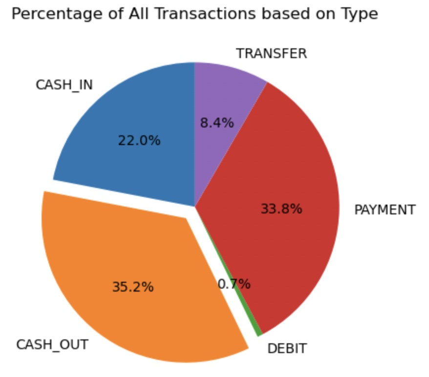
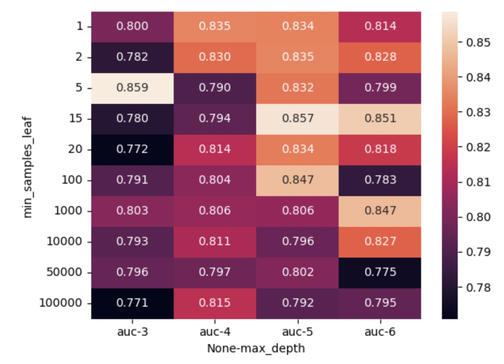
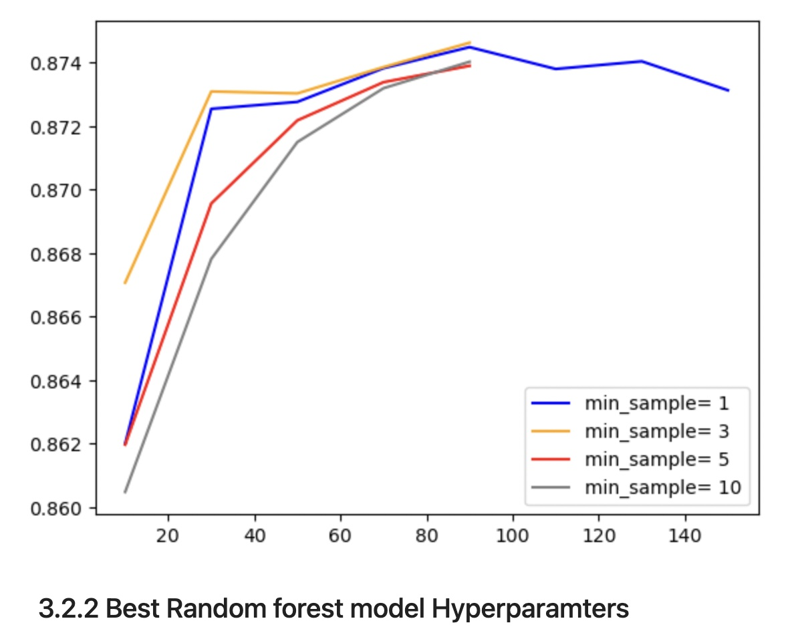
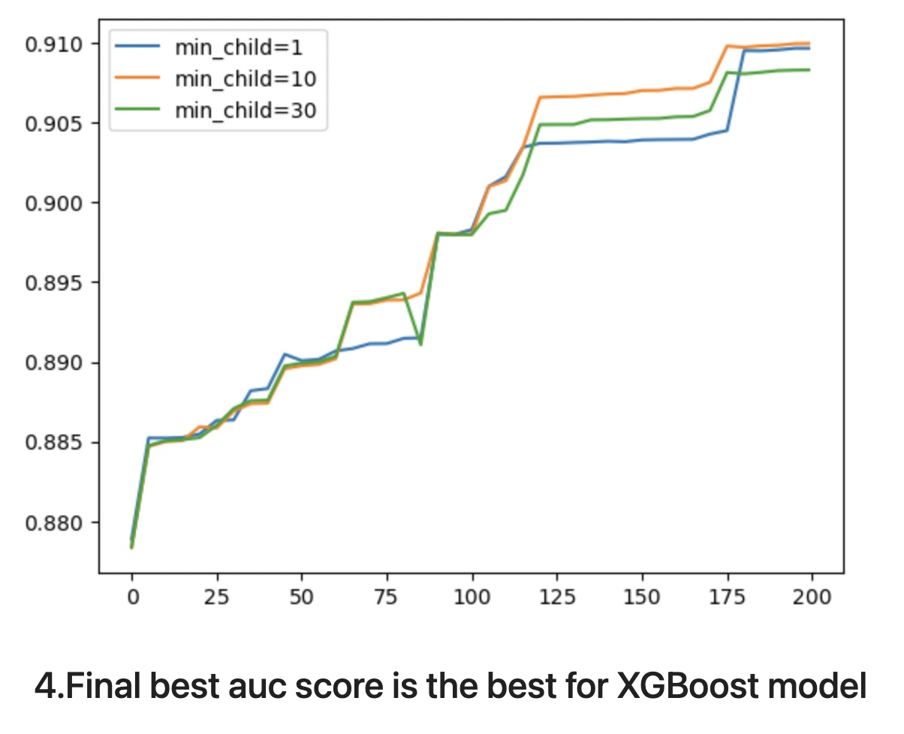

# Fraud Transaction Detection using Machine Learning

This repository contains the code and resources for fraud transaction detection using machine learning. The purpose of this project is to develop a model that can accurately identify fraudulent transactions in a given dataset.




## Problem Description

The problem we're addressing is the detection of fraud in financial transactions. With the increasing digitization of financial services and the rise of online transactions, fraudulent activities have become a significant concern for businesses and individuals alike. Fraudulent transactions can result in financial losses, damage to reputation, and compromised security.

Detecting fraud in real-time is crucial to minimize the impact of fraudulent activities. Traditional rule-based approaches are often limited in their effectiveness, as fraudsters constantly evolve their techniques. Machine learning provides an opportunity to build predictive models that can learn from historical data and identify patterns indicative of fraudulent behavior.

## Importance in Today's Context

The relevance of fraud transaction detection using machine learning has grown significantly in recent years. Here's why it's critical in today's context:

1. **Rising Sophistication of Fraudsters**: Fraudsters are continually developing new methods to exploit vulnerabilities in online transactions. Machine learning models can adapt and learn from evolving fraud patterns, enabling businesses to stay one step ahead of fraudulent activities.

2. **Growing Volume of Digital Transactions**: The shift towards digital transactions has accelerated, especially with the rise of e-commerce, online banking, and mobile payments. This increase in transaction volume makes it challenging to manually analyze each transaction for potential fraud. Machine learning models can automate the process and efficiently analyze large datasets for fraudulent patterns.

3. **Real-time Detection**: Timely detection of fraud is crucial to prevent financial losses. Machine learning models can process transactions in real-time, quickly flagging suspicious activities and triggering appropriate actions, such as transaction blocking or alerting fraud analysts.

4. **Enhanced Accuracy**: Machine learning models leverage advanced algorithms and statistical techniques to identify complex patterns and anomalies. This enables them to achieve higher accuracy in detecting fraudulent transactions compared to traditional rule-based systems.

5. **Cost Savings and Operational Efficiency**: By automating the fraud detection process, businesses can save costs associated with manual review and investigation of potential fraud cases. Machine learning models can prioritize alerts based on risk levels, enabling fraud analysts to focus their efforts on high-priority cases.

## **Model Training and Hyperparameters Tuning**

The notebook [training.ipynb](https://github.com/AbdelrahmanElmasry/ml-fraud-detection/blob/master/training.ipynb) provides a step-by-step guide on building and training the fraud detection model. Here's a summary of the main steps covered in the notebook:

1. **Data Preparation**: We start by importing the necessary libraries and loading the dataset. We then perform data preprocessing tasks such as handling missing values, encoding categorical variables, and scaling numerical features.

2. **Feature Engineering**: We analyze the dataset to identify relevant features and create new features that can enhance the model's predictive power. This may include transforming variables, creating interaction terms, or extracting meaningful information from existing features.

3. **Data Splitting**: The dataset is split into training and testing sets using the train-test split technique. This ensures that we have separate data for training the model and evaluating its performance.

4. **Model Implementation and Training**: We implement and train a machine learning model on the training data. In this project, we utilize the XGBoost algorithm due to its effectiveness in handling complex patterns and imbalanced datasets.

5. **Model Evaluation**: We evaluate the trained model's performance using various evaluation metrics such as accuracy, precision, recall, and F1 score. This helps us assess how well the model generalizes to unseen data and its ability to correctly identify fraudulent transactions.

6. **Hyperparameter Tuning**: We conduct hyperparameter tuning to optimize the model's performance. This involves exploring different combinations of hyperparameters and selecting the ones that yield the best results.

7. **Final Model Selection**: Based on the evaluation results, we select the best-performing model as our final fraud detection model.
### Training by Random forest AUC

### Training by Random forest AUC


### ===> XGBoost is the best model to predidct the fraud transations among the other used model ---


Please refer to the [training.ipynb](https://github.com/AbdelrahmanElmasry/ml-fraud-detection/blob/master/training.ipynb) file for detailed code implementation and explanations.

# **Conversion notebook to executable python script**
--
using jupyter nbconvert
## **Project Setup**
--

### Step 1: Cloning git repo
```bash
git clone https://github.com/AbdelrahmanElmasry/ml-fraud-detection.git
cd ml-fraud-detection
```

### Step 2: Install Dependencies

1. Ensure you have Python 3.8 installed on your system.

2. Create a virtual environment and install project dependencies using Pipenv:
    > to avoid any dependency conflict with your base environment

   ```bash
   pipenv install
   ```
- Packages
    - flask = "*"
    - pillow = "*"
    - waitress = "*"
    - tflite-runtime = "*"
    - requests = "*"

    This command will create a virtual environment and install the required packages from the Pipfile.
### Step 2: Activate the Virtual Environment

1. Once the dependencies are installed, activate the virtual environment with this command:

   ```bash
   pipenv shell
   ```

    You will see the command prompt left side prefix change to indicate that the environment is active.

    Now, your virtual environment is set up and activated. You can run your Flask application using Waitress with the following command:

    ```bash
    waitress-serve --listen=0.0.0.0:8000 predict:app
    ```
    or simply for dev usage only:

    ```bash
    python predict.py
    ```

## **Loading the model**
Serving it via a web service (with Flask or specialized software - BentoML, KServe, etc)
Files with dependencies
Pipenv and Pipenv.lock if you use Pipenv
or equivalents: conda environment file, requirements.txt or pyproject.toml
Dockerfile for running the service

## **Containerization**
---

This project has been containerized for easy deployment using Docker. To build and run the container, follow these steps:
### Step 1: Building the Container

1. Make sure you have Docker installed on your system.

2. Navigate to the directory containing your Dockerfile.

3. Use the following command to build the container. Replace `<container-name>` with your preferred container name (e.g., "ml-app"):

   ```bash
   docker build -t <container-Name> .
   ```
   Example
    ```bash
    docker build -t fraud-model .
    ```

    This command instructs Docker to build an image using the Dockerfile in the current directory.

### Step 2: Running the Container

1. Once the container is built, you can run it using the following command:

    ```bash
    docker run -it --rm -p 8080:8080 <container-name>
    ```
    > Example
     ```bash
    docker run -it --rm -p 8080:8080 fraud-model:latest
    ```

   - -it enables an interactive terminal.
   - --rm removes the container when it exits.
   - -p 8080:8080 maps port 9696 on your host to port 9696 within the container.
   - `<container-name>` is the name you provided when container image built.

   ## **Test Locally**
   Once the container is up and running 
    ```bash
       python lambda_test.py
    ```

    - Could be tested locally on `http://localhost:8080/2015-03-31/functions/function/invocations`.

    you should see the prediction result as following

        `{'isFraud': False}`

### Step 3: Publishing the image to ECR service
1. you will need AWSCLI to be installed
    ```bash
    pip install awscli
    ```
2. Configure the AWSCLI from command line
    ```bash
    aws configure
    ```
3. Create new repo
    ```bash
    aws ecr create-repository --repository-name <repo-name>
     ```
4. Tag the built image with ECR identifier
    ```bash
    docker tag clothing-model:latest ${REMOTE_URI}
    ```
5. Finally, Push the image to the registry
    ```bash
    docker push ${REMOTE_URI}
    ```

Deployment
URL to the service you deployed or
Video or image of how you interact with the deployed service

## **Cloud Deployment**
--
I used Lambda serverless service from AWS Cloud, where I'll focus only on the application level development and AWS will take care about the rest of details
- ### URL to the service
 HTTPS post method  [https://e6yc5urqh1.execute-api.eu-central-1.amazonaws.com/test/predict](https://e6yc5urqh1.execute-api.eu-central-1.amazonaws.com/test/predict)

### Usage

To run the code and reproduce the results, you can clone this repository and open the [training.ipynb](https://github.com/AbdelrahmanElmasry/ml-fraud-detection/blob/master/training.ipynb) file in a Jupyter Notebook environment. Please make sure to have all the required libraries installed before running the notebook.
